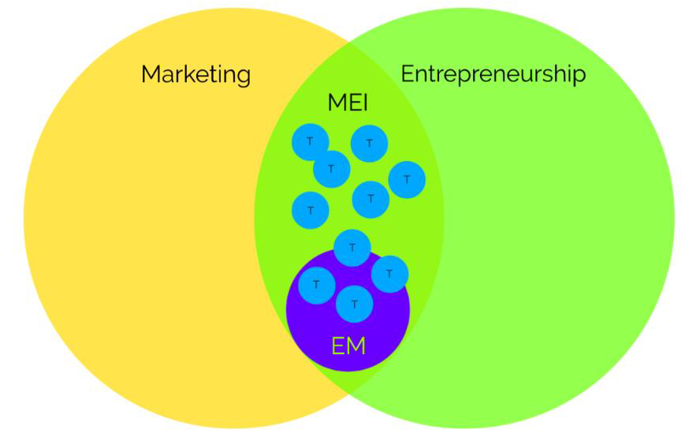

# UGent_Master_Thesis
Topic modelling to explore domain interface between marketing and entrepreneurship

# Background
After more than 30 years of conceptual work in trying to respond to the growing demand for a unifying framework for the MEI, little progress has been made (David J. Hansen et al., 2020). The standard depiction of the interface remains a Venn diagram of two overlapping circles: one representing entrepreneurship and the other marketing. While this model is visually appealing, it does not provide any insight into potential research questions and is not helpful as guidance for developing the marketing and entrepreneurship interface.

# Objective
This thesis presents an application where topic modelling (Machine Learning) is used to conduct an exploratory literature review with the aim of describing the MEI domain. Through the use of topic modelling, clear categories can be formed. Furthermore, the use of machine learning minimizes human biases and allows hidden or overlooked topics in this research field to be uncovered. Machine learning and topic modelling more specifically has not yet been used to obtain insights into academic marketing research or to uncover the MEI.

