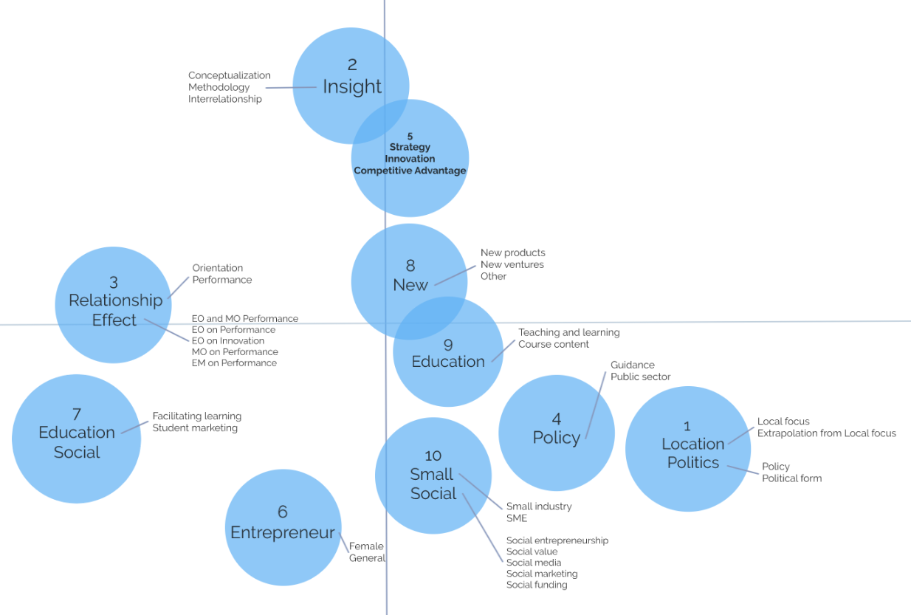

# UGent_Master_Thesis
Topic modelling to explore domain interface between marketing and entrepreneurship

# Background
After more than 30 years of conceptual work in trying to respond to the growing demand for a unifying framework for the MEI, little progress has been made (David J. Hansen et al., 2020). The standard depiction of the interface remains a Venn diagram of two overlapping circles: one representing entrepreneurship and the other marketing. While this model is visually appealing, it does not provide any insight into potential research questions and is not helpful as guidance for developing the marketing and entrepreneurship interface.

# Objective
This thesis presents an application where topic modelling (Machine Learning) is used to conduct an exploratory literature review with the aim of describing the MEI domain. Through the use of topic modelling, clear categories can be formed. Furthermore, the use of machine learning minimizes human biases and allows hidden or overlooked topics in this research field to be uncovered. Machine learning and topic modelling more specifically has not yet been used to obtain insights into academic marketing research or to uncover the MEI.

                                         Venn diagram representation of the MEI

# Result
The MEI is incredibly broad and topic modelling helped to describe it and uncover less obvious ideas that would likely not have come to surface in a traditional exploratory review. A total of 56 625 research articles were processed into various LDA topics. What has been discovered went beyond the stereotype perception of this interface that is slanted towards marketing strategies or how to execute strategies in an entrepreneurial setting. The M10 topic model is explored in detail but only represents the tip of the iceberg of what can be found by using this method. It infers meaningful context for 10 broad categories of topics, provides a coherently catalogued overview of the literature on each topic and shows shifting trends in research. Based on the conclusions of topic contextualization and trend analysis, this thesis explores hidden perspectives of this cross-domain interface, including the aspects of education, research methodologies, social activities, key impact elements, and more.

                                                Contextualised MEI
